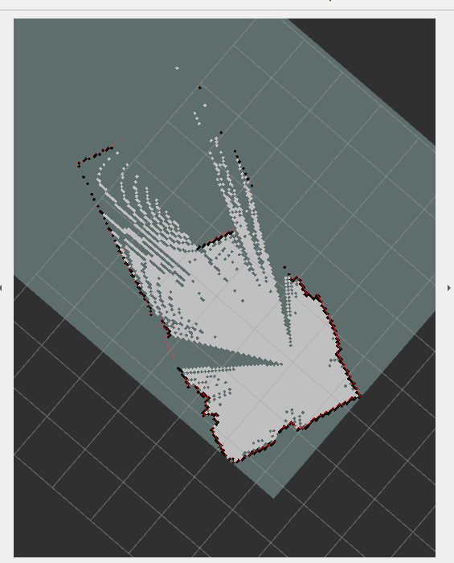

# Mapping using ROS packages

Repository uses rplidar along with slam_toolbox to create realtime map.


Clone repository with submodules:
```bash
git clone --recurse-submodules https://github.com/SzymKwiatkowski/rplidar_ros
```
if submodules are not pulled along with project use:
```bash
git submodule update
```


## Requirements
Slam toolbox:
```bash
sudo apt update && sudo apt install -y ros-humble-slam-toolbox
```

Install required packages via rosdep:
```bash
rosdep update && rosdep install --from-path src
```

## Usage
To test package there is bag file in rplidar_ros repository that can be use to preview test data of map and it can be run via:
```bash
ros2 bag play src/ros_mapping/rplidar_ros/lidar_bag --loop
```

After using bag file then mapping can be run via:
```bash
ros2 launch mapping mapping.launch.py
```
It can be also run with rviz2 alongside with built in config with another launch file:
```bash
ros2 launch mapping view_mapping.launch.py 
```

Mapping is using slam_toolbox and it can be easily modified via params file in config directory. 

## Result
Result should look like this:
<p align="center">

</p>